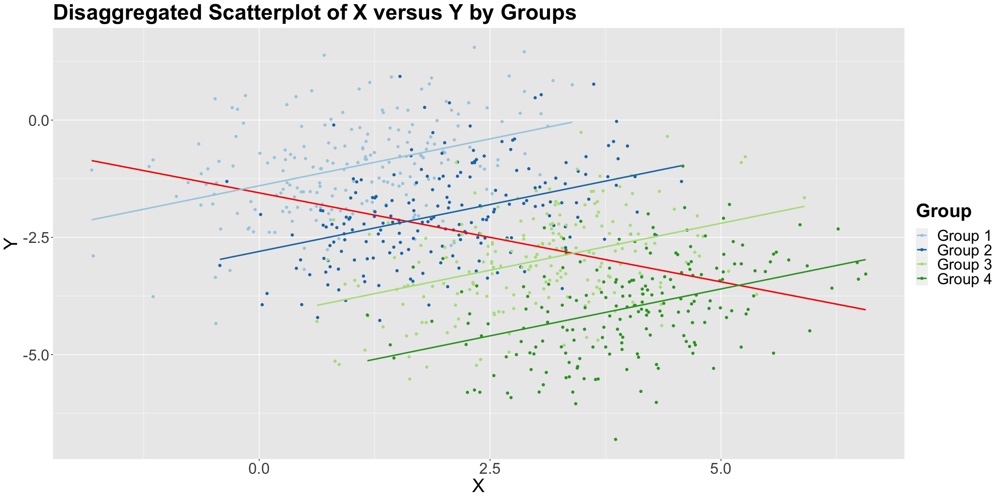

# Lecture 2: Confounding and Randomized vs Non-Randomized Studies

## Observational vs Experimental Studies

- **Experimental**: The researcher **manipulates** the independent variable and observes the effect on the dependent variable.
  - E.g See if new gym class reduces body fat percentage, so **randomly assign** people to new and old class
- **Observational**: The researcher observes the effect of the independent variable on the dependent variable without manipulating the independent variable.
  - E.g. See if new gym class reduces body fat percentage, so **select** people who signed up for new and old class

## Simpson's Paradox

- Arises when the association/trend between two variables is reversed when a third variable (**confounder**) is taken into account
  - Leads to deceptive statistical conclusions

### Confounding Factors

- Criteria to be a confounder:
  1. Related to the outcome by prognosis/ susceptibility
  2. the distribution of the confounding factor is different in the groups being compared
- Confounder is a variable related to both the explanatory and response variables
- Important to consider because without considering them, we may unkowingly observe a false demonstration of an association or the masking of an association between the explanatory and response variables.

### Strategies to Address Confounding

1. **Stratification**: good for observational data
   - Implies checking the association between $X$ and $Y$ within each stratum of the confounder
   - **Drawback**: need to know all possible confounders
2. **Analysis of Variance (ANOVA)**: good for experimental data
   - Randomize each subject to a level of $X$
     - **Randomization** breaks the dependency between exploratory/ response variables and confounders
   - Then compare $Y$ across levels of $X$
      

- The **second strategy** is the golden standard in causal inference and design and analysis of experiments
  - The regressor $X$ is guaranteed to be independent of all possible confounders (known and unknown)
  - No longer need to be concerned with confounding
  - Can interpret the association between $X$ and $Y$ in a causal manner
