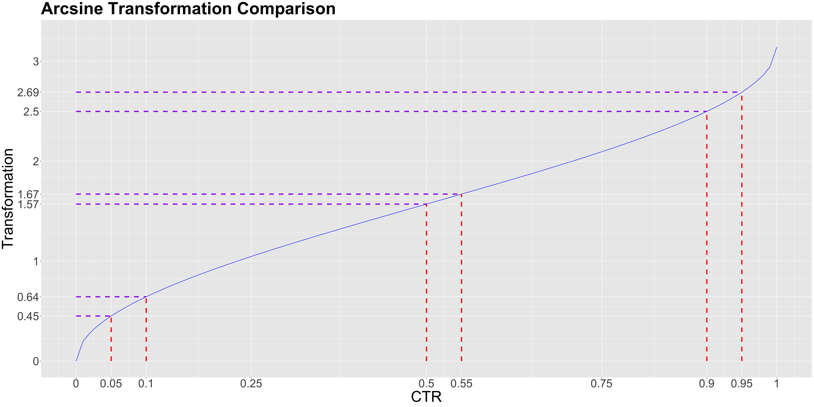
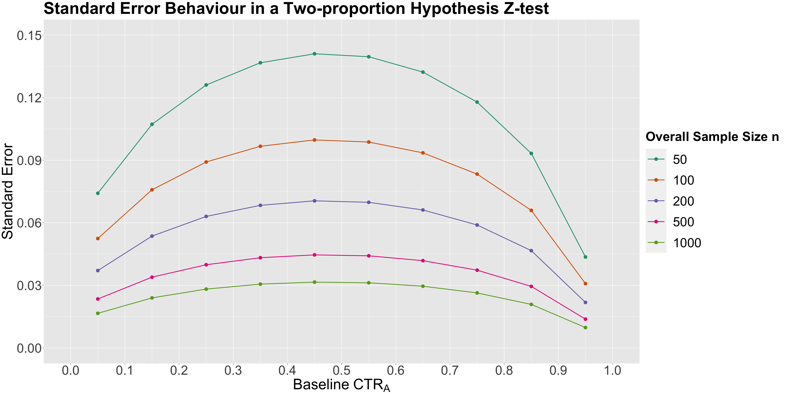
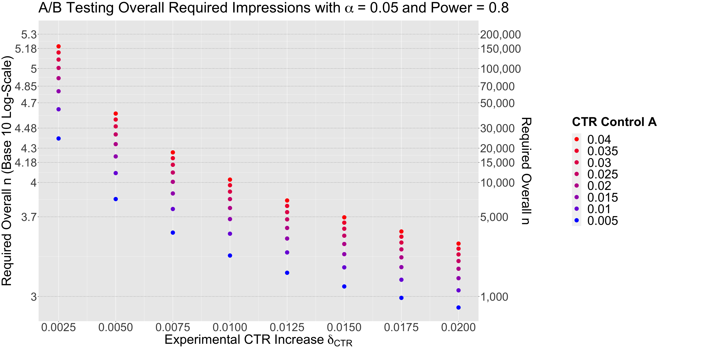

# Lecture 5: More about Power and early stopping in A/B Testing

### Sample size computation in proportion tests

- Earlier was test with mean duration (continouous response) -> use t-test
- We use **z-test** for **proportion tests**
  - proportion means value between 0 and 1
- E.g. see the click through rate (CTR) of a website between control "X" and treatment "Y"
  - CTR $\in [0, 1]$

#### Effect size $h$

- No need $\sigma$ nor $\mu$ for proportion test
- Need to know the effect size $h$ (difference in proportions)
  - Use `ES.h(data_control, data_treatment)` to calculate
- Effect size has an **arcsine transformation**:

$$h = 2 \arcsin(\sqrt{p_Y}) - 2 \arcsin(\sqrt{p_X})$$

- This means:
  - Smaller transformed effect (y-axis) in the middle
  - Larger transformed effect (y-axis) at the ends



- This behaviour is related to the **statistic's standard error** of the two-proportion z-test
  - $\delta = p_Y - p_X$
  - $H_0: \delta < some\_value$, $H_a: \delta \geq some\_value$

$$
Z = \frac{\hat{\delta}_{\text{CTR}} - some\_value}{\sqrt{\frac{\hat{\text{CTR}}_A (1 - \hat{\text{CTR}}_A)}{n/2} + \frac{\hat{\text{CTR}}_B (1 - \hat{\text{CTR}}_B)}{n/2}}} = \frac{\hat{\delta}_{\text{CTR}} - some\_value}{\text{SE}\left(\hat{\delta}_{\text{CTR}}
\right)}
$$



_More error in the middle, less error at the ends. Smaller sample size = more error_

#### Using function `pwr.2p.test`

```R
CTR_effect_size = ES.h(data_control, data_treatment)

pwr.2p.test(
  h = CTR_effect_size,
  sig.level = alpha,
  power = pow,
  alternative = "greater"
)
```



We can see that we need more sample size when:

- $\delta$ is smaller
- $CTR_X$ is closer to 0.5, more error in the middle

### Early stopping in A/B Testing

- **Peeking**: looking at the data before the experiment is over/ through the experiment
- Still compute overall sample size to get $n_{max}$
- If at some peek, **updated test statistic** is significant, we can stop the experiment

</br>

- **Aggresive Peeking**: look at the data after every new experimental unit
  - If test $P_Y > P_X$ (and in fact it is true), aggressive peeking will improve power of the test if:
    - $P_Y > 1.5 * P_X$
    - Otherwise, it gives a concerning power decrease
  - If test $P_Y = P_X$,
    - the proportion of replicates where $z_{test} > z_{1- \alpha}$ correspond to type I error rate
    - will lead to **inflating the type I error rate**
