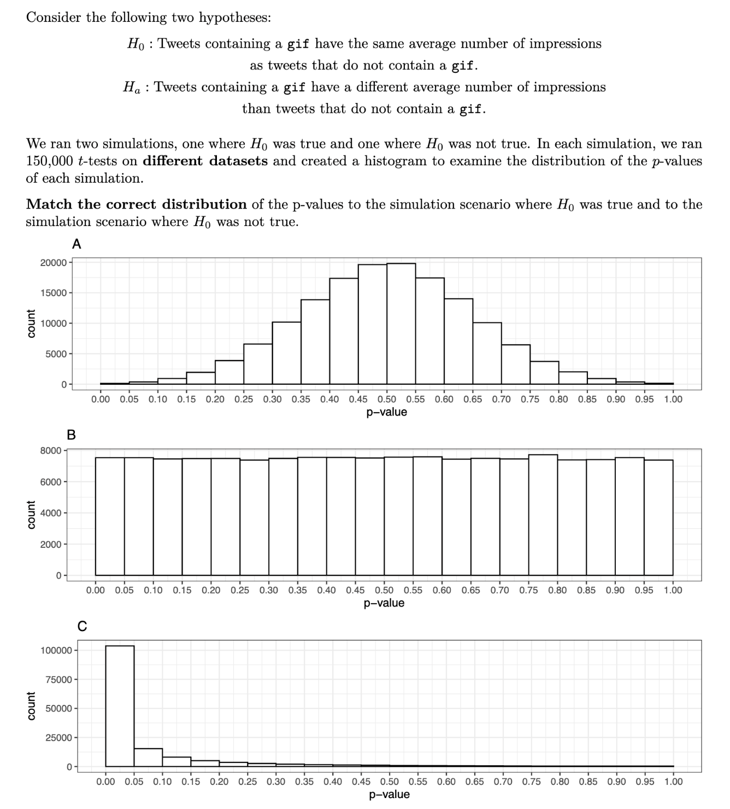
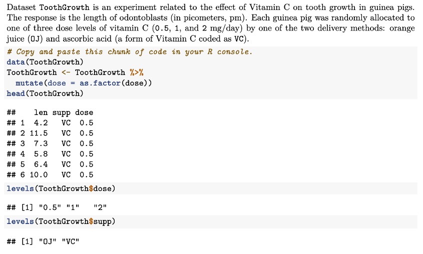

# 554 Practice Quiz 1

## Question 1

**In one or two sentences and your own words, explain how experimental studies differ from observational
studies.**

- Experimental: The researcher manipulates the independent variable and observes the effect on the dependent variable.
- Observational: The researcher observes the effect of the independent variable on the dependent variable without manipulating the independent variable.

## Question 2

- $H_0$ is false: is **Option C** because if the $H_0$ is false, then the $H_a$ is true, so the p-value must be < 0.05 95% of the time.
- $H_0$ is true: means there is no statistical difference so the p-value distribution must be uniform so it is **option B**.

## Question 3

**To answer this question, take Question 2 as the context.**
**Using your own words, rewrite the inferential statement in Ha to make it causal.**

$H_a$: Including a `gif` causes a tweet to receive a different average number of impressions than a tweet without a `gif`.

## Question 4

**What is a confounder? why is it important to consider cofounders in a study?**

- A confounder is a variable that is related to both the explanatory and response variables.
- Important to consider because without considering them, we may unkowingly observe a false demonstration of an association or the masking of an association between the explanatory and response variables.

## Question 5

**How does randomization contribute to establishing a causal relationship in the context of an experimental
study? Answer in two to three sentences and in your own words.**

- Randomization breaks the dependency between exploratory/ response variables and confounders.
- With no confounders, we can interpret the association between exploratory and response variables in a causal manner.

## Question 6

**Is the following an example of an experimental or observational study?
A gym wants to collect evidence to show that their new Zumba class reduces body fat percentage
compared to the original Zumba class. They randomly select 30 gum-goers who just signed up for
this new Zumba class, as well as 30 gym-goers who just signed up for their original Zumba class.
Then, they measure the body fat percentage of all randomly selected gym-goers before and after
ten weeks of attending these classes.**

Observational because they select from groups not assign.

## Question 7

**The main inquiry in this experiment is the following:
Is there any statistically significant combination of dose level and delivery method that maximizes
the length of odontoblasts compared to the baseline dose of 0.5 mg/day and orange juice? If so,
by how much?
Based on the previous framework, answer the following:**

1. **How many treatments do we have in this experiment? Answer briefly.**
   - 6 treatments, 3 dose levels, and 2 delivery methods.
2. **In an experimental framework, what is the dose combination of 0.5 mg/day and orange juice? Answer
   briefly.**
   - It is the control treatment group.
3. **Is this a balanced or unbalanced experiment? Why or why not? Answer in one or two sentences.**
   - balanced because each treatment group has the same number of observations.

## Question 8

**To answer this question, take Question 7 as the context.
How would you statistically analyze this experimental data to answer the main inquiry? Answer in one
or two sentences while justifying your model.
Then, fit the model and provide the corresponding code.**

- continouous response with 2 factors, so use ANOVA with an interaction term.

## Question 9

- COnservative so use bonferroni guarantee (FWER)
