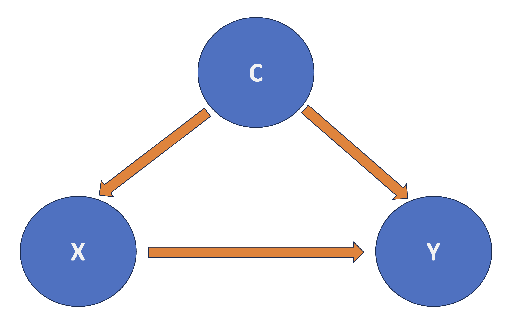
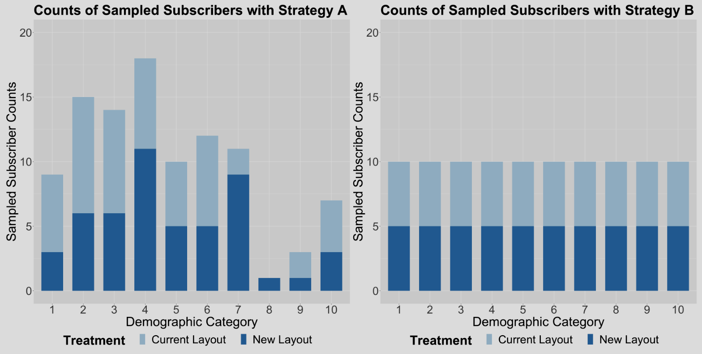

# 554 Quiz 1 CS

## Observational vs Experimental Studies

- **Experimental**: The researcher **manipulates** the independent variable and observes the effect on the dependent variable.
  - E.g See if new gym class reduces body fat percentage, so **randomly assign** people to new and old class
- **Observational**: The researcher observes the effect of the independent variable on the dependent variable without manipulating the independent variable.
  - E.g. See if new gym class reduces body fat percentage, so **select** people who signed up for new and old class

## Hypothesis Testing Review

- Recall [552 Hypothesis Testing](https://mds.farrandi.com/block_2/552_stat_inter/552_stat_inter#hypothesis-testing)

- Tolerance to **Type I Error** is $\alpha$
  - $\alpha = P(\text{reject null} | \text{null is true})$
  - Reject $H_0$ when $p < \alpha$

### Why is it Important in Science?

- Easier to publish paper if findings are significant at $\alpha = 0.05$
- By Construction:
  - $H_0$ is "conservative"/ "boring"/ "status quo"
  - $H_a$ is "exciting"/ "new"/ "interesting"
- When $p > \alpha$, we fail to reject $H_0$
  - Does not mean $H_0$ is true
  - Just means we do not have enough evidence to reject it
  - Makes bad headlines: (e.g. "Null Hypothesis Not Rejected")
- **P-Hacking**: Repeatedly testing until $p < \alpha$
  - Inflate Type I Error Rate
  - Does not always mean if $p < \alpha$, the result is significant
    - BE SCEPTICAL OF PAPERS, DO NOT BELIEVE EVERYTHING
  - Need **Bonferroni Correction** to adjust for multiple comparisons

### Example: Finding out Food to Health Relationship

- Have 20 foods to test and 20 body parts to test
- In total get 400 tests (20 foods \* 20 body parts)
- Simulate that the food is NOT related to any body part
- However, when we randomly test, we will get around 40% of the tests significant at $\alpha = 0.05$
  - 162 tests is significant of the 400
- This is because of **Multiple Comparisons**
  - We inflate the Type I Error Rate ($\alpha$ is too high)
  - Need to adjust (decrease) $\alpha$ to account for multiple comparisons

#### Why is this the case?

$$
E_ i = \text{Committing Type I error in the } i \text{th test} \\
P(E_ i) = \alpha.
$$

The probability of NOT committing Type I error in the $i$th test is the following:
$$P\left(E_ i^c\right) = 1 - \alpha$$

Probability of NOT committing Type I error in any of the tests is:
$$P\left(\bigcap_{i=1}^n E_ i^c\right) = \left(1 - \alpha\right)^n$$

Probability of committing at least one Type I error in the tests is:
$$P\left(\bigcup_{i=1}^n E_ i\right) = 1 - P\left(\bigcap_{i=1}^n E_ i^c\right) = 1 - \left(1 - \alpha\right)^n$$

The inflated probability corresponds to committing AT LEAST one Type I error in the $m$ tests.

## Multiple Comparisons

### Bonferroni Correction

- Conservatively guard against p-hacking
- Idea: If we do $m$ tests, then $\alpha$ should be $\frac{\alpha}{m}$

```r
pval # Matrix of p-values

# Bonferroni Correction
pval_corrected = p.adjust(pval, method = "bonferroni")
```

### Bonferroni Guarantee

Let $R_i$ be the event of rejecting $H_0$ when $H_0$ is true for the $i$th test. Then:

$$
P\left(E_ i^c\right) \leq \sum_{i=1}^m P\left(R_i\right)
$$

This leads to the **Family-Wise Error Rate (FWER)**

- The chance that **one or more** of the true null hypotheses is rejected

$$
FWER \leq \sum_{i=1}^m \frac{\alpha}{m} = \alpha
$$

- The Bonferroni Correction guarantees that we **wrongly reject** the null hypothesis with probability less than $\alpha$

- **Drawback: Very Conservative**

$$P(R_1 \; \cup \; R_2) \leq P(R_1) + P(R_2)$$

Works if $R_1$ and $R_2$ are _mutually exclusive_.

- If not, then $P(R_1 \; \cup \; R_2) =  P(R_1) + P(R_2) - P(R_1 \; \cap \; R_2)$

So then the there will be too much correction -> TOO CONSERVATIVE / More Type II Errors

### False Discovery Rate (FDR)

- We cannot just look at p-value and see if study is significant
- Need to find out how much "hunting" they did
- There is a trade-off between **false discoveries** (FP) and **missing real effects** (FN)

$$FDR = \frac{FP}{FP + TP}$$

- **LESS STRICT** than Bonferroni Correction
  - It is a method to control the **Expected Proportion of False Positives** instead of the probability of **one or more** false positives

#### Benjamini-Hochberg (BH) Procedure

- One method to control FDR
- Method:

  1. Specify a _maximum acceptable FDR_ $\alpha$
  2. Order the p-values from smallest to largest
  3. Find the largest $k$ such that $p_{(k)} \leq \frac{k}{m} \alpha$
     - $p_{(k)}$ is the $k$th smallest p-value
  4. Take the $k$ smallest p-values as significant

- Get **BH adjusted p-values** as: $\min \Big\{ \frac{p\text{-value}_i \times m}{i}, \text{BH adjusted } p\text{-value}_{i + 1} \Big\}$

```r
# Benjamini-Hochberg Procedure
pval_corrected = p.adjust(pval, method = "fdr")
```

### When to Use FWER vs. FDR

| FWER                                | FDR                                    |
| ----------------------------------- | -------------------------------------- |
| When there is high confidence to TP | When there is certain proportion of FP |
| Want to be conservative             | Want to be less conservative           |
| Prefer **False Negatives**          | Prefer **False Positives**             |
| `TukeyHSD`                          | `pairwise.prop.test(method="BH")`      |

## Simpson's Paradox

- Arises when the association/trend between two variables is reversed when a third variable (**confounder**) is taken into account
  - Leads to deceptive statistical conclusions


### Confounding Factors

- Criteria to be a confounder:
  1. Related to the outcome by prognosis/ susceptibility
  2. the distribution of the confounding factor is different in the groups being compared
- Confounder is a variable related to both the explanatory and response variables
- Important to consider because without considering them, we may unkowingly observe a false demonstration of an association or the masking of an association between the explanatory and response variables.



### Strategies to Address Confounding

1. **Stratification**: good for observational data
   - Implies checking the association between $X$ and $Y$ within each stratum of the confounder
   - **Drawback**: need to know all possible confounders
2. **Analysis of Variance (ANOVA)**: good for experimental data
   - Randomize each subject to a level of $X$
     - **Randomization** breaks the dependency between exploratory/ response variables and confounders
   - Then compare $Y$ across levels of $X$
     </br>

- The **second strategy** is the golden standard in causal inference and design and analysis of experiments
  - The regressor $X$ is guaranteed to be independent of all possible confounders (known and unknown)
  - No longer need to be concerned with confounding
  - Can interpret the association between $X$ and $Y$ in a causal manner

## Foundations of A/B and A/B/n Testing

- **A/B Testing**: randomized experiment between **control** and **treatment** groups
- **A/B/n Testing**: randomized experiment between **control** for more than 2 groups (n is not the same as n samples)
- Recall: randomization makes variables independent of any confounding variables
- Hence we can infer causality instead of just association

### A/B Testing with Continuous Response

#### Common Terminology

- Example: Have two categorical variables: `color`: blue/red and `font_size`: small/ medium/ large to predict `duration` of stay on a website
- **Variables**: `color`, `font_size`
  - 6 possible treatment groups: 3 font sizes \* 2 colors
  - If all 6 are used -> **Full Factorial Design**, specifically **2x3 Factorial Design**
- Each user is **experimental unit**
- Each treatment group involves **replicates** (multiple experimental units)
  - The experimental units are randomly assigned to treatment groups

| Terms               | Definitions                                                                                                                                                                                                                                 |
| ------------------- | ------------------------------------------------------------------------------------------------------------------------------------------------------------------------------------------------------------------------------------------- |
| Stratification      | Process of splitting the population into homogenous subgroups and sampling observational units from the population independently in each subgroup.                                                                                          |
| Factorial Design    | Technique to investigate effects of several variables in one study; experimental units are assigned to all possible combinations of factors.                                                                                                |
| Cofounder           | A variable that is associated with both the explanatory and response variable, which can result in either the false demonstration of an association, or the masking of an actual association between the explanatory and response variable. |
| Blocking            | Grouping experimental units (i.e., in a sample) together based on similarity.                                                                                                                                                               |
| Factor              | Explanatory variable manipulated by the experimenter.                                                                                                                                                                                       |
| Experimental Unit   | The entity/object in the sample that is assigned to a treatment and for which information is collected.                                                                                                                                     |
| Replicate           | Repetition of an experimental treatment.                                                                                                                                                                                                    |
| Balanced Design     | Equal number of experimental units for each treatment group.                                                                                                                                                                                |
| Randomization       | Process of randomly assigning explanatory variable(s) of interest to experimental units (e.g., patients, mice, etc.).                                                                                                                       |
| Treatment           | A combination of factor levels.                                                                                                                                                                                                             |
| A/B Testing         | Statistically comparing a key performance indicator (conversion rate, dwell time, etc.) between two (or more) versions of a webpage/app/add to assess which one performs better.                                                            |
| Observational Study | A study where the researcher does not randomize the primary explanatory variables of interest.                                                                                                                                              |

#### Two-way ANOVA with main effects only

- Typically initial analysis in A/B testing
- main effects: standalone regressors (e.g. `color`, `font_size`)

$$
Y_{i,j,k} = \mu_{i} + \tau_{j} + \varepsilon_{i, j, k}
$$

- For $i$th `font` and $j$th `color`, for the $k$th experimental unit

```R
OLS_ABs_main_effects <- lm(formula = Duration ~ Font + Color, data = data)
anova(OLS_ABs_main_effects)
```

- ANOVA tables go hand-in-hand with randomized experiments


- p-values tests the hypothesis that:
  - $H_0$: $\mu_{1} = \mu_{2} = \mu_{3}$ (no effect of `font`)
  - $H_a$: at least one $\mu_{i}$ is different
- Recall: If p-value < 0.05, we reject the null hypothesis
- `Df` represents the degrees of freedom
  - It is of the formula: `# of levels - 1`

#### Two-way ANOVA with interaction effects

$$
Y_{i,j,k} = \mu_{i} + \tau_{j} + (\mu\tau)_{i,j} + \varepsilon_{i, j, k}
$$

- Adds the interaction term $(\mu\tau)_{i,j}$ to the model
  - Does not indicate they are multiplied

```R
OLS_ABs_interaction <- lm(formula = Duration ~ Font * Color, data = data)
anova(OLS_ABs_interaction)
```

- `Df` for interaction term is the product of `Df1` and `Df2`

#### Post-hoc tests

- Done if any factor is significant
- Compares all possible pairs among the levels
  - Involves multiple testing corrections
- Will use Tukey's HSD test
  - Keeps the Family-Wise Error Rate (FWER) at $\alpha$ or less
  - Only for ANOVA models

```R
# Need aov: basically lm but for ANOVA
OLS_aov_ABn <- aov(formula = Duration ~ Font * Color, data = data)
TukeyHSD(OLS_aov_ABn, conf.level = 0.95) |> tidy()
```

## Blocking

- **Blocking Factor**: a variable that is not of primary interest (and cannot be controlled) but is known to affect the response variable
  - Consider as grouping factor
  - Examples: time period when A/B testing is conducted, user demographics, etc.
- **“Block what you can, randomize what you cannot.”**
  - **Blocking**: removing the effect of secondary measurable variables from the response
    - This is so our model could get statistical association/ causation between the secondary variable and the response variable
  - **Randomization**: removing the effect of unmeasurable variables



_Strategy A: Just Randomize, Strategy B: Randomize and Block_

### Blocking Procedure

1. Stratify experimental units into homogenous blocks. Each stratum is a block
2. Randomize the experimental units into the treatment groups within each block

### Randomization and Blocking Recap

Sorted Best to Worst:

1. Model with blocking for blocking factors + Post-Hoc adjustments
2. Normal data with Post-Hoc adjustments for blocking factors (Treat blocking as a covariate)
   - **covariate**: a variable that is possibly predictive of the response variable
3. Raw model with no blocking nor Post-Hoc adjustments

## Increasing Sample Size

- Increasing sample size would:
  - Increase the **accuracy** of the estimates
  - Increase the **power** of the test
    - **Power**: probability of rejecting the null hypothesis when it is false (predict correctly)
      - High power means our A/B test is robust enough to detect and estimate experimental treatment effects
    - In class had example: Need 10x the sample size for raw to perform equal to covariate/ blocking
- But this model would not capture the right systematic component of the population, including the **stratum effect** (demographic categories)
- Using covariate and blocking would still be more precise
- Need to consider that increasing sample size is also expensive

### Power in Sample Size Computations

- Recall that sample size computations involve playing around with three concepts:
  1. **effect size**: how much we want the experimental treatment to differ from the control treatment in terms of the mean response
  2. **significance level** $\alpha$
     - Lower = more strict (less prone to Type I error/ false positive)
     - $P(\text{reject } H_0 | H_0 \text{ is true}) = \alpha$
  3. **power** of the test $1 - \beta = 1 - P(\text{Type II error})$,
     - Typically 0.8
     - larger = less prone to Type II error
     - $P(\text{reject } H_0 | H_a \text{ is true}) = 1 - \beta = 1 - P(\text{accept } H_0 | H_a \text{ is true})$


| Decision                     | True Condition Positive ($H_a$ True) | True Condition Negative ($H_0$ True) |
| ---------------------------- | ------------------------------------ | ------------------------------------ |
| Test Positive (Reject $H_0$) | Correct (True Positive)              | Type I Error (False Positive)        |
| Test Negative (Accept $H_0$) | Type II Error (False Negative)       | Correct (True Negative)              |

_see more in [my statistical inference notes](https://mds.farrandi.com/block_2/552_stat_inter/552_stat_inter.html#visual-representation-of-errors)_

#### Example case

- Lets say we want to see if changeing website design from "X" to "Y" will increase the average time spent on the website.
- We know:
  - Current average is between 30s to 2 min
  - We want to see a 3% increase in time spent
- Calculation:
  - $\mu_x = 0.5 + \frac{2-0.5}{2} = 1.25 \text{ min}$
  - Using 95% CI, $Z_i = \frac{Y_i - \mu_A}{\sigma} \sim \mathcal{N}(0, 1)$
    - $1.96 = \frac{2 - \mu_A}{\sigma}$
    - $\sigma = \frac{2 - 1.25}{1.96} = 0.383$
  - $\delta = 0.03 \times 1.25 = 0.0375$ (desired difference)
    </br>
- Use `pwr.t.test` function in R to calculate sample size needed
  - will give `n` (sample size) needed for **each** group

```R
pwr.t.test(
  d = 0.0375 / 0.383, # delta / sigma
  sig.level = 0.05,
  power = 0.8,
  type = "two.sample",
  alternative = "greater" # we want to see an increase
)
```


_Lower power means need less sample size_


_Higher response increase means more power for a given sample size_

### Block Homogeneity and Power

- We want to ensure that the blocks are **homogeneous**:
  - As **much** variation in $\mu$ as possible is **across** the blocks
  - As **little** variation in $\mu$ as possible is **within** the blocks
- If not homogenous: blocking can be worse than raw
- The blocking setup needs to be carefully planned before running the experiment.
